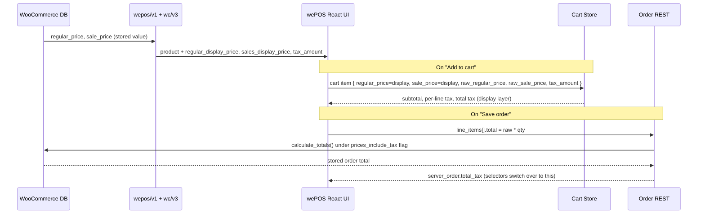

# wePOS Tax Handling: Inclusive / Exclusive Reference

This document explains how wePOS keeps cashier-visible totals consistent with WooCommerce's stored order totals across every combination of `woocommerce_prices_include_tax` and `woocommerce_tax_display_cart`. It also walks every scenario (simple, sale, variation) through the actual code paths so a future maintainer can re-verify any single row.

- Target audience: wePOS contributors and integrators building on the cart store / product response
- Applies to: wePOS ≥ 2.0.0


## TL;DR

- WooCommerce has two independent tax settings: one controls **how prices are stored**, the other controls **how prices are displayed**. Treat them as separate concerns.
- Each cart item carries **two** price pairs: `regular_price` / `sale_price` (display, drive the UI) and `raw_regular_price` / `raw_sale_price` (raw, drive the order payload).
- The server enriches every product / variation response with `regular_display_price`, `sales_display_price`, `tax_amount` — computed per-base-price (regular and sale separately).
- Shop grid, cart row, and receipt always go through `pickRegularDisplayPrice` / `pickSaleDisplayPrice` so they show the same number.
- Order payload sends `raw_*`, which means the same thing on both sides of the wire regardless of how the display is configured.
- `tax_display_cart` and `available_tax` are store-wide reference data — preserved across `CLEAR_CART` and `HYDRATE_CART`.
- `getTotalTax` falls back to `server_order.total_tax` after the order is saved.


## Table of Contents

- [The Two WooCommerce Settings](#the-two-woocommerce-settings)
- [Display vs Order Payload — the Split](#display-vs-order-payload--the-split)
- [Server-Side: Product Response](#server-side-product-response)
- [Client-Side: Hydration into the Store](#client-side-hydration-into-the-store)
- [Cart Math in the Store](#cart-math-in-the-store)
- [Order Payload Construction](#order-payload-construction)
- [End-to-End Flow](#end-to-end-flow)
- [Behavior Walkthrough — Every Combination](#behavior-walkthrough--every-combination)
- [Sale Product — All Four Combinations](#sale-product--all-four-combinations)
- [Variation Products — All Four Combinations](#variation-products--all-four-combinations)
- [Edge Cases](#edge-cases)
- [Testing](#testing)
- [Troubleshooting](#troubleshooting)
- [References](#references)


## The Two WooCommerce Settings

| Option key | Role |
|---|---|
| `woocommerce_prices_include_tax` | Declares whether `regular_price` / `sale_price` stored on a product is **tax-inclusive** or **tax-exclusive**. `WC_REST_Orders_V2_Controller::save_object` sets this flag on the order, and `calculate_totals()` interprets every posted `total` / `subtotal` under it. |
| `woocommerce_tax_display_cart` | Display-only preference: show cart prices including or excluding tax. Independent of how prices are stored. |

`woocommerce_tax_display_shop` is **not used** by wePOS — the cashier UI always follows the cart-display setting.


## Display vs Order Payload — the Split

Each cart item carries **two** price pairs:

| Field on `POSCartItem` | Source | Used by |
|---|---|---|
| `regular_price` / `sale_price` | Server-computed display price (`regular_display_price` / `sales_display_price` from [`Manager::product_response`](./../includes/REST/Manager.php#L63)) | Cart UI — subtotal, per-line price, sale strikethrough |
| `raw_regular_price` / `raw_sale_price` | Untouched `product.regular_price` / `product.sale_price` | Order payload — `line_items[].total` / `subtotal` interpreted against `woocommerce_prices_include_tax` |

This separation is the fix. Display math is unchanged from the legacy Vue UI. The order payload now sends a value that means the same thing on both sides of the wire.

Type lives in [`types/index.ts`](./../src/frontend/types/index.ts) (`POSCartItem`).


## Server-Side: Product Response

[`Manager::product_response`](./../includes/REST/Manager.php#L63) enriches each product (and variation) REST response with three tax-aware fields:

| Output field | Computed as | Notes |
|---|---|---|
| `regular_display_price` | `regular_excl_tax + regular_tax` when `tax_display_cart === 'incl'`, otherwise `regular_excl_tax` | Always derived from the regular price base |
| `sales_display_price` | `sale_excl_tax + sale_tax` when `tax_display_cart === 'incl'`, otherwise `sale_excl_tax` | Derived from the sale price; `0` when not on sale |
| `tax_amount` | `sale_tax` when on sale, otherwise `regular_tax` | Drives the per-line tax label and the "Including Tax" hint |

**Why compute tax per-price.** `wc_get_price_including_tax( $product )` returns the *effective* price (sale price when on sale), so deriving one `$tax_amount` from it and adding the same amount to both the regular and sale lines would mis-tax the regular row on an on-sale product. The function computes `regular_tax` and `sale_tax` from their own base prices.

**Why these getters honor `prices_include_tax`.** Both `wc_get_price_excluding_tax()` and `wc_get_price_including_tax()` consult `woocommerce_prices_include_tax` internally to interpret the input `price` argument. The previous outer `if/else` on `$tax_calculations` was textually identical in both arms — dead code, dropped.


## Client-Side: Hydration into the Store

On POS load, [`pages/Home.tsx`](./../src/frontend/pages/Home.tsx) runs two effects:

1. Mirror `settings.woo_tax.wc_tax_display_cart` into the store via [`setTaxDisplayMode`](./../src/frontend/store/cart/actions.ts#L139).
2. Fetch `/wepos/v1/taxes` and dispatch [`setAvailableTax`](./../src/frontend/store/cart/actions.ts#L146).

When a product is added to the cart, the cart item is hydrated from the product response:

```ts
regular_price:     pickRegularDisplayPrice(product), // regular_display_price ?? regular_price
sale_price:        pickSaleDisplayPrice(product),    // sales_display_price  ?? sale_price ?? regular_price
raw_regular_price: toFiniteNumber(product.regular_price),
raw_sale_price:    toFiniteNumber(product.sale_price),
tax_amount:        toFiniteNumber(product.tax_amount),
```

Variations use the same pattern in [`ProductVariationSelector.tsx`](./../src/frontend/components/ProductVariationSelector.tsx) and fall back to the parent product's `tax_amount` via `firstPresentNumber( variation.tax_amount, product.tax_amount )` when the variation does not report its own. Misc/custom products set `raw_*` equal to the entered price — there is no display/raw distinction since WC interprets that single value under `prices_include_tax`.

**The shop product grid uses the same display-price helpers.** [`ProductGridView`](./../src/frontend/components/ProductGridView.tsx), [`ProductListView`](./../src/frontend/components/ProductListView.tsx), and the search dropdown ([`SearchBar`](./../src/frontend/components/SearchBar.tsx)) all render `pickRegularDisplayPrice` / `pickSaleDisplayPrice` — not raw `product.regular_price`. Without this, the grid would show the *stored* price while the cart row shows the *cart-display* price, and those differ in two of the four matrix rows (rows 2 and 3 below). The product grid, the cart, and the receipt always agree on the number for any given product.

Helpers: [`pickRegularDisplayPrice`](./../src/frontend/utils/helpers.ts#L191), [`pickSaleDisplayPrice`](./../src/frontend/utils/helpers.ts#L198), [`toFiniteNumber`](./../src/frontend/utils/helpers.ts#L163), [`firstPresentNumber`](./../src/frontend/utils/helpers.ts#L170).

**Reference-data invariant.** `tax_display_cart` and `available_tax` are store-wide reference data — not part of a cart snapshot. Both `HYDRATE_CART` (cart restore) and `CLEAR_CART` (void / new sale) preserve them, so an empty cart still has the rates needed to compute fee/coupon tax once items are re-added. Mutate them only through `setTaxDisplayMode` / `setAvailableTax`.


## Cart Math in the Store

Three selectors in [`store/cart/selectors.ts`](./../src/frontend/store/cart/selectors.ts) cover every tax surface:

| Selector | Returns | Used by |
|---|---|---|
| `getTaxDisplayMode` | `'incl' \| 'excl'` from the store | Cart UI label switches (single source of truth — Cart components must not re-read from `settings`) |
| `getTotalLineTax` | `Σ tax_amount × qty` over every line | "Including Tax" hint under Subtotal. Never zeroed, even in `incl` mode. |
| `getTotalTax` | Line tax (zeroed when `tax_display_cart === 'incl'` to avoid double-counting) + fee tax + coupon tax adjustment. After save, switches to `server_order.total_tax`; if the server reports `0`, falls back to the **total/sub gap**, and beyond that to the **pre-save local computation** in excl mode (see [WC-silent fallback](#wc-silent-fallback)). | Headline "Tax" row. Direct port of legacy `Cart.module.js:52-102`. |

The line-tax / total-tax split exists because in `incl` mode the Subtotal row already contains tax — adding line tax to the visible total would double-count. The "Including Tax" hint still needs the raw figure, so `getTotalLineTax` stays unconditional.

**Coupon adjustment in `incl` mode.** Because `lineTax` is forced to `0` in `incl` mode, `couponTaxReduction = (discountAmount / subtotal) * 0 = 0`. This is mathematically correct: the incl-mode subtotal already bakes tax into the line price, so a coupon reducing `$X` simultaneously reduces both the price and the tax bundled inside it — no separate reduction line is needed.

### WC-silent fallback

After `saveToServer` runs, WC sometimes returns the order with `total_tax = "0"` even when the cart was already showing tax. This happens when WC's `WC_Tax::find_rates()` can't resolve a tax rate from the order's location — typically a guest order with no billing address, where the standard rate has a country restriction that doesn't match the shop base.

Without a fallback the cart would lose the Tax row after save — a math contradiction visible to the cashier and a real loss of tax info in the printed receipt. `getTotalTax` recovers it through two layered fallbacks, applied only when `serverTax === 0`.

**Layer 1 — total/sub gap.** Used when the raw line price already bundles the tax (incl-stored prices, `prices_include_tax = yes`). `server.total` carries the bundled tax even though `server.total_tax` doesn't break it out, so the gap surfaces it:

```ts
gap = server.total - (subtotal − totalDiscount + totalFee + totalShipping)
if (gap > 0.01) return gap
```

**Layer 2 — pre-save local computation.** Used when the gap is `0` (no bundled tax to recover). The selector falls through to the same `lineTax + feeTax − couponTaxReduction` formula the cart uses pre-save, sourced from each item's `tax_amount` and the cached `available_tax` rates. In excl mode this restores the per-line tax that WC failed to add on top (the `prices_include_tax = no, tax_display_cart = excl` row, where the raw line price excludes tax and `server.total` equals `subtotal`). In incl mode `lineTax` is already zeroed to avoid double-counting, so only taxable fees pass through — `feeTax` correctly surfaces even when WC silently dropped it.

**`getTotal` partner change.** With `getTotalTax` synthesising tax, `getTotal` can no longer blindly return `server.total` (which would be lower than `subtotal + tax`). It now returns `Math.max(server.total, computed)`, where `computed = subtotal − discount + fee + shipping + totalTax`. `serverTax > 0` shortcircuits this to `server.total` (authoritative when WC resolved the rate).

Properties across the matrix:

| `prices_include_tax` | `tax_display_cart` | When WC silently returns `total_tax=0` | Fallback used | Cart total |
|---|---|---|---|---|
| **no**  | **excl** | `server.total = $100` (raw, no tax added) | Layer 2 (local) | $110 (= 100 + 10) |
| **no**  | **incl** | `server.total = $100` (raw, no tax added), `subtotal = $110` (display incl) | None — `getTotalTax = 0`, `getTotal` uses `max(server, computed) = $110` | $110 |
| **yes** | **excl** | `server.total = $100` (raw incl tax), `subtotal = $90.91` (display excl) | Layer 1 (gap = $9.09) | $100 |
| **yes** | **incl** | `server.total = $100` (raw incl tax), `subtotal = $100` (display incl) | None — gap is 0 and tax is bundled in the displayed line price | $100 |

The print receipt builder in [`Home::processPayment`](./../src/frontend/pages/Home.tsx) reuses the cart's `total` and `totalTax` selectors directly — the printed `Tax Total` and `Order Total` match the cart row in every case.

> **Note:** the fallbacks are a display safety net. The order saved in WC still has `total_tax = "0"` in the database — accounting / tax reports will not see this tax. The root fix is to ensure WC can resolve a rate (set a shop base country, or supply a billing country on the order). The fallback only prevents UI inconsistency, not the underlying loss of tax data on the saved order.

**Extension point.** `getTotalTax` runs the result through the `wepos_cart_total_tax` filter. The payload is `{ lineTax, feeTax, couponTaxReduction }` — derived totals only, never the live store reference — so a filter callback cannot mutate cart state from inside the filter.


## Order Payload Construction

[`Home::buildOrderPayload`](./../src/frontend/pages/Home.tsx#L883) builds the body sent to `wc/v3/orders`. The critical change: `line_items[].total` and `subtotal` come from `raw_*`, not display prices.

```ts
const rawRegular = item.raw_regular_price ?? item.regular_price; // legacy in-memory carts
const rawSale    = item.raw_sale_price    ?? item.sale_price;
const unitPrice  = item.on_sale ? rawSale : rawRegular;

lineItem.subtotal = (unitPrice * item.quantity).toFixed(2);
lineItem.total    = (unitPrice * item.quantity).toFixed(2);
```

Misc/custom products post their cashier-entered `price` directly — WC interprets it against `prices_include_tax` like any other product. The cart UI (subtotal, per-line price, total tax row) keeps reading `regular_price` / `sale_price` and is unaffected.


## End-to-End Flow




## Behavior Walkthrough — Every Combination

All combinations were traced end-to-end through the current code. Setup is the same throughout: **WooCommerce → Settings → Tax → 10% standard rate, `$100` regular price**. Each row of the table is reproducible from the linked file.

Matrix summary:

| `prices_include_tax` | `tax_display_cart` | Shop grid | Cart row | Cart total | Saved order |
|---|---|---|---|---|---|
| **no**  | **excl** | $100 | $100 + $10 tax | **$110** | **$110** ✓ |
| **no**  | **incl** | $110 | $110 ("Including Tax") | **$110** | **$110** ✓ |
| **yes** | **excl** | $90.91 | $90.91 + $9.09 tax | **$100** | **$100** ✓ |
| **yes** | **incl** | $100 | $100 ("Including Tax") | **$100** | **$100** ✓ |

Shop grid and cart row always agree. Cart total always equals the saved order total.

### Scenario A — `prices_include_tax = no, tax_display_cart = excl`

Stored value is tax-exclusive; display is tax-exclusive. The classic "sticker price + tax at checkout" model used in the US.

| Stage | Code | Result |
|---|---|---|
| WC DB | `regular_price` | `"100"` (means $100 excl) |
| Server response | [`Manager::product_response`](./../includes/REST/Manager.php#L84) — `regular_excl_tax=100, regular_incl_tax=110, regular_tax=10, show_incl_tax=false` | `regular_display_price="100.00"`, `tax_amount="10.00"` |
| Shop grid | [`pickRegularDisplayPrice(product)`](./../src/frontend/utils/helpers.ts#L191) | renders **$100** |
| Add to cart | [`Home.tsx#L474`](./../src/frontend/pages/Home.tsx#L474) | `regular_price=100, raw_regular_price=100, tax_amount=10, on_sale=false` |
| `getSubtotal` | `regular_price × qty` | `100` |
| `getTotalLineTax` | `tax_amount × qty` (raw, for hint) | `10` |
| `getTotalTax` | excl mode → `lineTax` included | `10` |
| `getTotal` | `subtotal + totalTax` | `110` |
| Cart UI | subtotal $100; per-line `+ tax $10`; "Tax $10"; Checkout `$110` | $110 |
| Order payload | `line_items[0].total = (raw × qty).toFixed(2)` = `"100.00"` | $100 sent |
| WC interpretation | `prices_include_tax=no` ⇒ posted `total` is excl ⇒ add 10% | `total=$110, total_tax=$10` |

**Why correct vs WooCommerce.** WC native checkout in this config also shows `$100 + $10 tax = $110`. wePOS sends the same raw `$100` line item, and WC's own `calculate_totals()` applies the same `prices_include_tax=no` flag — identical math.

### Scenario B — `prices_include_tax = no, tax_display_cart = incl`

Stored excl, displayed incl. Common in the UK / EU where stickers must show the all-in price even though the DB stores excl. **This is one of the two rows where the fix is load-bearing.**

| Stage | Code | Result |
|---|---|---|
| WC DB | `regular_price` | `"100"` (excl) |
| Server response | `show_incl_tax=true` → `regular_display = regular_excl_tax + regular_tax = 100 + 10` | `regular_display_price="110.00"`, `tax_amount="10.00"` |
| Shop grid | `pickRegularDisplayPrice` | **$110** |
| Add to cart | display→`regular_price=110`, raw→`raw_regular_price=100`, `tax_amount=10` | — |
| `getSubtotal` | `110 × 1` | `110` |
| `getTotalLineTax` | `10` (unconditional for the hint) | `10` |
| `getTotalTax` | incl mode → `lineTax = 0` (would double-count) | `0` |
| `getTotal` | `110 + 0` | `110` |
| Cart UI | subtotal **$110** + "Including Tax" hint; per-line `incl. tax $10`; **no separate Tax row**; Checkout `$110` | $110 |
| Order payload | `total = raw × qty = "100.00"` | $100 sent |
| WC interpretation | `prices_include_tax=no` ⇒ posted `$100` is excl ⇒ + 10% | `total=$110, total_tax=$10` |

**Why correct vs WooCommerce.** WC frontend in this config also shows `$110 (incl. $10 tax)` in the cart. The trap is that the cart shows `$110` but the *stored* price is `$100`. Sending `$110` to the order endpoint would tell WC "tax-exclusive $110" → final `$121` — a `$11` overcharge. wePOS sends `$100` raw, matching what WC stored, so `calculate_totals()` produces `$110` exactly.

### Scenario C — `prices_include_tax = yes, tax_display_cart = excl`

Stored incl, displayed excl. Used when a merchant prefers to store tax-inclusive prices but show breakdown at checkout. **The second load-bearing row.**

| Stage | Code | Result |
|---|---|---|
| WC DB | `regular_price` | `"100"` (already includes $9.09 tax) |
| Server response | `regular_excl_tax = wc_get_price_excluding_tax($100) ≈ 90.91`; `regular_tax = 100 - 90.91 = 9.09`; `show_incl_tax=false` → `regular_display = 90.91` | `regular_display_price="90.91"`, `tax_amount="9.09"` |
| Shop grid | `pickRegularDisplayPrice` | **$90.91** |
| Add to cart | display→`regular_price=90.91`, raw→`raw_regular_price=100`, `tax_amount=9.09` | — |
| `getSubtotal` | `90.91 × 1` | `90.91` |
| `getTotalLineTax` | `9.09` | `9.09` |
| `getTotalTax` | excl mode → `lineTax = 9.09` | `9.09` |
| `getTotal` | `90.91 + 9.09` | `100` |
| Cart UI | subtotal $90.91; per-line `+ tax $9.09`; "Tax $9.09"; Checkout `$100` | $100 |
| Order payload | `total = raw × qty = "100.00"` | $100 sent |
| WC interpretation | `prices_include_tax=yes` ⇒ posted `$100` already includes tax | `total=$100, total_tax=$9.09` |

**Why correct vs WooCommerce.** WC native this config shows `$90.91 + $9.09 = $100`. The trap is that *display* is `$90.91`, but sending `$90.91` to the order with `prices_include_tax=yes` would tell WC "$90.91 is already incl" → final `$90.91`, breaking the cashier's expectation by `$9.09`. wePOS sends the stored `$100` raw — WC keeps it as-is — total reconciles.

### Scenario D — `prices_include_tax = yes, tax_display_cart = incl`

Stored incl, displayed incl. The simplest case — display equals what's stored.

| Stage | Code | Result |
|---|---|---|
| WC DB | `regular_price` | `"100"` (incl) |
| Server response | `regular_excl=90.91, regular_tax=9.09, show_incl_tax=true` → `regular_display = 90.91 + 9.09 = 100` | `regular_display_price="100.00"`, `tax_amount="9.09"` |
| Shop grid | `pickRegularDisplayPrice` | **$100** |
| Add to cart | display→`regular_price=100`, raw→`raw_regular_price=100`, `tax_amount=9.09` | — |
| `getSubtotal` | `100` | `100` |
| `getTotalLineTax` | `9.09` (for hint) | `9.09` |
| `getTotalTax` | incl mode → `lineTax = 0` | `0` |
| `getTotal` | `100` | `100` |
| Cart UI | subtotal $100 + "Including Tax" hint; per-line `incl. tax $9.09`; **no separate Tax row**; Checkout `$100` | $100 |
| Order payload | `total = raw × qty = "100.00"` | $100 sent |
| WC interpretation | `prices_include_tax=yes` ⇒ keep as-is | `total=$100, total_tax=$9.09` |

**Why correct vs WooCommerce.** WC native cart shows `$100 (incl. $9.09 tax)`. wePOS shows the same and sends the same `$100` raw — no transformation needed in either direction.


## Sale Product — All Four Combinations

Setup: `regular_price=$100, sale_price=$80, on_sale=true`, 10% tax.

Manager.php computes **regular_tax** and **sale_tax** from their own base prices (this is the sale-product secondary fix — the legacy code used a single `tax_amount` derived from `wc_get_price_including_tax($product)`, which silently returned the sale price for an on-sale product and mis-taxed the strikethrough regular row). `tax_amount` is the effective tax: `sale_tax` when on sale, `regular_tax` otherwise.

| Combo | regular_excl / sale_excl | regular_tax / sale_tax | regular_display | sales_display | `tax_amount` | Shop / cart shows | Cart total | Saved |
|---|---|---|---|---|---|---|---|---|
| **no, excl** | 100 / 80 | 10 / 8 | 100 | 80 | 8 | ~~$100~~ **$80** + tax $8 | **$88** | **$88** ✓ |
| **no, incl** | 100 / 80 | 10 / 8 | 110 | 88 | 8 | ~~$110~~ **$88** (incl) | **$88** | **$88** ✓ |
| **yes, excl** | 90.91 / 72.73 | 9.09 / 7.27 | 90.91 | 72.73 | 7.27 | ~~$90.91~~ **$72.73** + tax $7.27 | **$80** | **$80** ✓ |
| **yes, incl** | 90.91 / 72.73 | 9.09 / 7.27 | 100 | 80 | 7.27 | ~~$100~~ **$80** (incl) | **$80** | **$80** ✓ |

The strikethrough row is `pickRegularDisplayPrice(product)` and the active row is `pickSaleDisplayPrice(product)` — both per-base-price values, so the two rows match the merchant's mental model in every combo. Order payload uses `raw_sale_price = $80` (because `on_sale=true`), and WC interprets it under `prices_include_tax` exactly like a non-sale product.

**Why correct vs WooCommerce.** WC frontend renders sale products with the same strikethrough-regular / active-sale pattern using `wc_get_price_to_display`, which itself routes through `wc_get_price_excluding_tax` / `wc_get_price_including_tax` per base price. Manager.php replicates that calculation server-side so the POS receives the same numbers WC would render on the storefront.


## Variation Products — All Four Combinations

Setup: variable product with a variation `regular_price=$100`, 10% tax.

`Manager::product_response` is hooked for both `woocommerce_rest_prepare_product_object` **and** `woocommerce_rest_prepare_product_variation_object` ([`Manager.php#L36`](./../includes/REST/Manager.php#L36)), so every variation in `product.variations` carries its own `regular_display_price` / `sales_display_price` / `tax_amount`. The variable parent's own `regular_display_price` is `0` (parent has no price of its own) — never used.

| Combo | Variation `regular_display_price` | `tax_amount` | Shop grid (price range or single) | After variation picked, cart row | Cart total | Saved order |
|---|---|---|---|---|---|---|
| **no, excl** | 100 | 10 | $100 | $100 + tax $10 | **$110** | **$110** ✓ |
| **no, incl** | 110 | 10 | $110 ("Including Tax") | $110 (incl) | **$110** | **$110** ✓ |
| **yes, excl** | 90.91 | 9.09 | $90.91 | $90.91 + tax $9.09 | **$100** | **$100** ✓ |
| **yes, incl** | 100 | 9.09 | $100 ("Including Tax") | $100 (incl) | **$100** | **$100** ✓ |

[`ProductGridView.getVariablePriceRange`](./../src/frontend/components/ProductGridView.tsx) iterates `product.variations` and runs `pickSaleDisplayPrice` / `pickRegularDisplayPrice` per variation, so a multi-variation product shows e.g. `"$80 – $120"` using each variation's own display price.

[`ProductVariationSelector.handleAddVariation`](./../src/frontend/components/ProductVariationSelector.tsx#L67) hydrates the cart item from the chosen variation using the same helpers (`pickRegularDisplayPrice`, `pickSaleDisplayPrice`, raw fields, `tax_amount` with fallback `firstPresentNumber(variation.tax_amount, product.tax_amount)`). The cart row, the order payload, and the saved total then behave exactly as the simple-product scenarios above.

### Sale variation, combo B (`no, incl`) — worked example

| Stage | Result |
|---|---|
| Variation stored: `regular_price=100, sale_price=80, on_sale=true` | — |
| Manager.php on variation: `regular_excl=100, regular_tax=10, regular_display=110`; `sale_excl=80, sale_tax=8, sale_display=88`; `tax_amount=8` (on sale) | — |
| Shop grid (price range) | `"$88"` (or range with siblings) |
| Pick variation → cart | `regular_price=110, sale_price=88, raw_regular=100, raw_sale=80, tax_amount=8, on_sale=true` |
| Cart row | ~~$110~~ **$88** with `incl. tax $8` |
| `getSubtotal` | `88` |
| `getTotalTax` (incl) | `0` |
| `getTotal` | `88` |
| Order payload | `total = rawSale × qty = "80.00"` |
| WC interpretation | `prices_include_tax=no` → $80 + 10% = `$88, total_tax=$8` |
| Cart $88 vs saved $88 | ✓ |

**Why correct vs WooCommerce.** Native WC variable products use the same per-variation pricing on the storefront. Each variation is a distinct WC_Product with its own `regular_price` / `sale_price`. wePOS treats each one identically — the per-variation `tax_amount` is computed from that variation's own base prices, not from the parent. The parent fallback exists only as a safety net for variations that somehow lack a computed `tax_amount` field.


## Edge Cases

- **Empty sale price.** `'' === $sale_price` short-circuits `sale_excl_tax` / `sale_incl_tax` to `0.0` ([`Manager.php#L95`](./../includes/REST/Manager.php#L95)) — avoids an `E_WARNING` from `wc_get_price_excluding_tax` on some PHP versions.
- **Variation `tax_amount` missing.** `firstPresentNumber( variation.tax_amount, product.tax_amount )` falls back to the parent product so the per-line label still renders.
- **Legacy in-memory carts.** Items added before this build have no `raw_*` fields. `buildOrderPayload` falls back to `regular_price` / `sale_price` so existing carts keep working until refreshed.
- **Server round-trip.** Once `wc/v3/orders` returns, `getTotalTax` switches to `server_order.total_tax`. Subsequent UI renders reflect WC's authoritative number, not the local approximation.
- **Misc/custom products.** No display/raw split — cashier types one price; WC interprets it under `prices_include_tax`. The cart UI shows the same number the cashier typed.
- **Tax fetch / restore race.** If `restoreServerCart` finishes before `/wepos/v1/taxes` resolves, fee/coupon tax adjustment is `0` until rates arrive. Self-corrects: `HYDRATE_CART` preserves `available_tax`, and once `setAvailableTax` fires, selectors recompute.


## Testing

1. WooCommerce → Settings → Tax → set a 10% standard rate.
2. For each of the four `prices_include_tax × tax_display_cart` permutations:
   1. Add the $100 regular product.
   2. Confirm the cart UI total.
   3. Place the order; open it in `wp-admin → Orders` and confirm the saved total equals the cart total.
3. **Sale product**: under `prices_include_tax=no, tax_display_cart=incl`, add `regular=$100, sale=$80`. Verify strikethrough reads `$110` and the active line reads `$88`.
4. **Variations**: add a variable product. Confirm the variation's `tax_amount` (or parent fallback) labels the row.
5. **Misc/custom item**: add a cashier-entered `$50` product. Saved order total must equal `$50` in `prices_include_tax=no` and `$50` final-inclusive in `prices_include_tax=yes`.
6. **Fees and coupons**: add a taxable percent fee and a taxable coupon. Total tax row must reflect them before save (local computation) and continue to match after save (server response).
7. **Void / new sale**: clear the cart, then add a taxable product. Fee/coupon tax must still compute — `CLEAR_CART` preserves the tax rate table.


## Troubleshooting

- **Cashier total does not match saved order total**
  - Confirm `Manager::product_response` is registered (`woocommerce_rest_prepare_product_object` + `woocommerce_rest_prepare_product_variation_object`) and the response carries `regular_display_price`, `sales_display_price`, `tax_amount`.
  - Inspect a cart item in DevTools: it must have both `regular_price` / `sale_price` *and* `raw_regular_price` / `raw_sale_price`. If `raw_*` is missing, the cart is from a stale build — clear it and re-add.
  - Verify the `buildOrderPayload` output: `line_items[].total` must equal `(raw * qty).toFixed(2)`, never the display price.

- **Shop grid and cart row show different prices**
  - All three surfaces (`ProductGridView`, `ProductListView`, `SearchBar`) must route prices through `pickRegularDisplayPrice` / `pickSaleDisplayPrice`. Anything calling `formatPrice(product.regular_price)` directly will desync in the `no, incl` and `yes, excl` combos.

- **Fee or coupon tax is `0` until the order is saved**
  - The `/wepos/v1/taxes` fetch (in `Home.tsx`) has not resolved yet, or the request failed. Check the console for `wePOS: failed to fetch tax rates` and verify the `TaxController` route is registered.
  - In `incl` mode, coupon tax reduction is intentionally `0` — see the [Coupon adjustment in `incl` mode](#cart-math-in-the-store) note. The reduction is bundled into the line price.

- **Sale strikethrough shows the wrong number**
  - The strikethrough row uses `pickRegularDisplayPrice`; the active row uses `pickSaleDisplayPrice`. If both rows show the sale price, Manager.php's per-base-price computation may have regressed — verify `regular_excl_tax` and `sale_excl_tax` are computed separately.

- **Variation row has no `tax_amount` label**
  - Variations should fall back to `product.tax_amount` via `firstPresentNumber(variation.tax_amount, product.tax_amount)` in `ProductVariationSelector.tsx`. If the label is still missing, both the variation and the parent product lack `tax_amount` — check that `Manager::product_response` is hooked for the variation filter, not only the product filter.

- **Cart total snaps to a different number after "Save to Server"**
  - Expected — `getTotalTax` switches from the local computation to `server_order.total_tax`. If the snap is more than rounding noise, the local computation drifted from WC; reconcile by reading the row that fired in `getTotalTax` and comparing to WC's `tax_lines` in the saved order.

- **Tax row hidden after Save to Server / Back to Sale (even though it was visible before)**
  - WC returned `total_tax = "0"` because it couldn't resolve a tax rate from the order's location (guest order with no billing country, or shop base country missing). `getTotalTax` falls back first to the [total/sub gap](#wc-silent-fallback) (recovers bundled tax in `prices_include_tax = yes` rows) and then to the pre-save local computation (recovers excl-stored tax in `prices_include_tax = no, tax_display_cart = excl`). `getTotal` returns `max(server.total, computed)` so the cart row never drops below `subtotal + tax`.
  - Permanent fix: set a country on the shop base (`WooCommerce → Settings → General → Store address`), or supply a billing country on the order so `WC_Tax::find_rates()` can match. Otherwise the saved order will still record `total_tax = 0` in the database even though the UI displays the correct breakdown.

- **Printed receipt shows `Tax Total $0.00` while Order Total includes tax**
  - Same root cause as above — `parseFloat(orderResponse.total_tax)` returns `0`. The receipt builder in `Home::processPayment` now reads `totalTax` and `total` from the cart selectors directly, so it inherits both fallback layers and matches the cart row.


## References

- Backend
  - [`includes/REST/Manager.php`](./../includes/REST/Manager.php) — `product_response` filter, registers the variation hook
  - [`includes/REST/TaxController.php`](./../includes/REST/TaxController.php) — `/wepos/v1/taxes` endpoint
- Frontend — store
  - [`src/frontend/store/cart/selectors.ts`](./../src/frontend/store/cart/selectors.ts) — `getSubtotal`, `getTotalLineTax`, `getTotalTax`, `getTaxDisplayMode`, `wepos_cart_total_tax` filter
  - [`src/frontend/store/cart/reducer.ts`](./../src/frontend/store/cart/reducer.ts) — `HYDRATE_CART` / `CLEAR_CART` preserve `available_tax` and `tax_display_cart`
  - [`src/frontend/store/cart/actions.ts`](./../src/frontend/store/cart/actions.ts) — `setTaxDisplayMode`, `setAvailableTax`
  - [`src/frontend/store/cart/types.ts`](./../src/frontend/store/cart/types.ts) — `CartState`, `TaxRate`
- Frontend — UI
  - [`src/frontend/pages/Home.tsx`](./../src/frontend/pages/Home.tsx) — `setTaxDisplayMode` / `setAvailableTax` effects, `buildOrderPayload`, add-to-cart hydration
  - [`src/frontend/components/Cart.tsx`](./../src/frontend/components/Cart.tsx) — cart UI, reads `getTaxDisplayMode`
  - [`src/frontend/components/ProductGridView.tsx`](./../src/frontend/components/ProductGridView.tsx) / [`ProductListView.tsx`](./../src/frontend/components/ProductListView.tsx) / [`SearchBar.tsx`](./../src/frontend/components/SearchBar.tsx) — shop surfaces, route prices through display helpers
  - [`src/frontend/components/ProductVariationSelector.tsx`](./../src/frontend/components/ProductVariationSelector.tsx) — variation hydration with parent fallback
  - [`src/frontend/components/ReceiptModal.tsx`](./../src/frontend/components/ReceiptModal.tsx) — receipt rendering
- Frontend — helpers / types
  - [`src/frontend/utils/helpers.ts`](./../src/frontend/utils/helpers.ts) — `pickRegularDisplayPrice`, `pickSaleDisplayPrice`, `toFiniteNumber`, `firstPresentNumber`
  - [`src/frontend/types/index.ts`](./../src/frontend/types/index.ts) — `POSCartItem` (with `raw_*` fields), `Product`, `ProductVariation`, `POSProduct`
- WooCommerce upstream
  - `wc_get_price_excluding_tax( $product, [ 'price' => ... ] )`
  - `wc_get_price_including_tax( $product, [ 'price' => ... ] )`
  - `WC_REST_Orders_V2_Controller::save_object` — sets `prices_include_tax` flag on saved orders