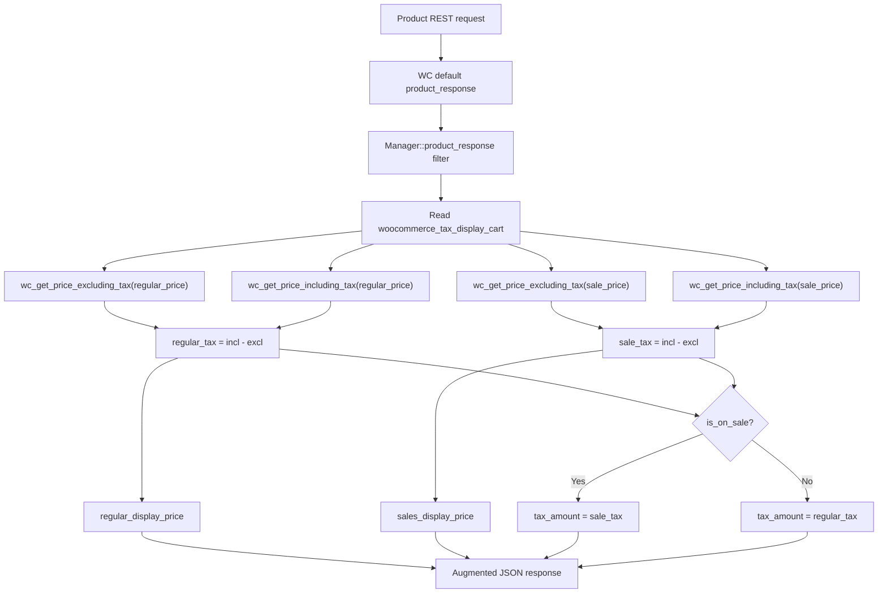
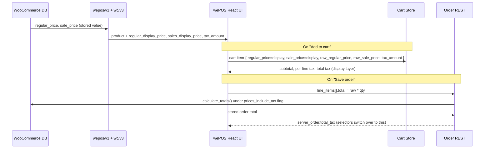

## wePOS Tax Handling (Inclusive / Exclusive)

- [Overview](#overview)
- [The Two WooCommerce Settings](#the-two-woocommerce-settings)
- [Display Layer vs Order Payload Layer](#display-layer-vs-order-payload-layer)
- [Server-Side: Product Response](#server-side-product-response)
- [Client-Side: Hydration into the Store](#client-side-hydration-into-the-store)
- [Cart Math in the Store](#cart-math-in-the-store)
- [Order Payload Construction](#order-payload-construction)
- [End-to-End Flow](#end-to-end-flow)
- [Behavior Matrix](#behavior-matrix)
- [Edge Cases](#edge-cases)
- [Testing](#testing)

### Overview

WooCommerce exposes two independent tax settings that wePOS must honor when products are added to the cart and an order is saved through the REST API. The most common production bug in this area is conflating the two — using the *display* price (which respects the cart-display setting) as the *order payload* price (which is interpreted under the prices-include-tax setting). When the two settings disagree, the order total saved on the server no longer matches what the cashier saw on the screen.

wePOS resolves this by keeping the two concerns on separate fields of the cart item: display prices drive the UI, raw prices drive the order payload sent to `wc/v3/orders`.

### The Two WooCommerce Settings

| Option key | UI label | Role |
|---|---|---|
| `woocommerce_prices_include_tax` | WooCommerce → Settings → Tax → *Prices entered with tax* | Declares whether the stored `regular_price` / `sale_price` on a product is **tax-inclusive** or **tax-exclusive**. This is the contract for the order REST API — `WC_REST_Orders_V2_Controller::save_object` flags the order via `$object->set_prices_include_tax( 'yes' === get_option( 'woocommerce_prices_include_tax' ) )` and then `calculate_totals()` interprets every posted `total` / `subtotal` under that flag. |
| `woocommerce_tax_display_cart` | WooCommerce → Settings → Tax → *Display prices during cart and checkout* | A **display-only** preference: show cart prices including or excluding tax. Independent of how prices are stored. |
| `woocommerce_tax_display_shop` | WooCommerce → Settings → Tax → *Display prices in the shop* | Display-only preference for the shop catalog. **wePOS does not use this setting** — the POS uses the cart display setting for the cashier UI. |

> The cart display setting changes what number the cashier sees. The prices-include-tax setting changes how WooCommerce *interprets* a posted number on the order endpoint. These are independent levers and they may disagree.

### Display Layer vs Order Payload Layer

The cart item carries **two** parallel price pairs:

| Field on `POSCartItem` | Source | Used by |
|---|---|---|
| `regular_price` / `sale_price` | Server-computed display price (`regular_display_price` / `sales_display_price` injected by [`Manager::product_response`](../includes/REST/Manager.php#L63)) | Cart UI — subtotal row, per-line price, strikethrough on sale |
| `raw_regular_price` / `raw_sale_price` | Untouched `product.regular_price` / `product.sale_price` from WC | Order payload only — passed as `line_items[].total` / `subtotal` so WC interprets them against `woocommerce_prices_include_tax` |

This separation is the entire fix. The display layer math (subtotal, per-line tax hint, total tax row) is unchanged from the legacy Vue UI. The order layer now sends a value that means the same thing on both sides of the wire.

Type declarations live in [`src/frontend/types/index.ts`](../src/frontend/types/index.ts) (`POSCartItem`).

### Server-Side: Product Response

[`Manager::product_response`](../includes/REST/Manager.php#L63) is hooked into the product REST response and enriches each product with three tax-aware fields:

| Output field | Computed as | Notes |
|---|---|---|
| `regular_display_price` | `regular_excl_tax + regular_tax` when `tax_display_cart === 'incl'`, otherwise `regular_excl_tax` | Always derived from the **regular** price base |
| `sales_display_price` | `sale_excl_tax + sale_tax` when `tax_display_cart === 'incl'`, otherwise `sale_excl_tax` | Always derived from the **sale** price base; `0` when the product is not on sale |
| `tax_amount` | `sale_tax` when on sale, otherwise `regular_tax` | Drives the per-line tax label and the "Including Tax" hint client-side |

**Why compute tax per-price.** WooCommerce's `wc_get_price_including_tax( $product )` returns the *effective* price (sale price when on sale), so deriving a single `$tax_amount` from it and adding the same amount to both the regular and sale display lines produces the wrong number on the regular row of an on-sale product. The function computes `regular_tax` and `sale_tax` from their own base prices independently.

**Why these getters honor `prices_include_tax`.** Both `wc_get_price_excluding_tax()` and `wc_get_price_including_tax()` consult `woocommerce_prices_include_tax` internally to interpret the input `price` argument. Removing the explicit `if ( 'no' === $tax_calculations )` branch from the previous implementation did not skip that logic — it pushed responsibility to WooCommerce, which already knew. The old code's outer `if/else` arms were textually identical, so the branch was dead code.



### Client-Side: Hydration into the Store

On POS load, [`pages/Home.tsx`](../src/frontend/pages/Home.tsx) runs two effects that synchronize the cart store with WooCommerce settings:

1. Mirror `settings.woo_tax` → `cart.tax_display_cart` via [`setTaxDisplayMode`](../src/frontend/store/cart/actions.ts#L139).
2. Fetch `/wepos/v1/taxes` and dispatch [`setAvailableTax`](../src/frontend/store/cart/actions.ts#L146).

When a product is added to the cart, the cart item is hydrated from the product response:

```ts
regular_price:     pickRegularDisplayPrice(product), // regular_display_price ?? regular_price
sale_price:        pickSaleDisplayPrice(product),    // sales_display_price  ?? sale_price ?? regular_price
raw_regular_price: toFiniteNumber(product.regular_price),
raw_sale_price:    toFiniteNumber(product.sale_price),
tax_amount:        toFiniteNumber(product.tax_amount),
```

Variations use the same pattern in [`ProductVariationSelector.tsx`](../src/frontend/components/ProductVariationSelector.tsx) and fall back to the parent product's `tax_amount` when the variation does not report its own. Misc/custom products (cashier-entered) set `raw_*` equal to the entered price — there is no display/raw distinction because WC interprets that single value under `prices_include_tax`.

Helpers: [`pickRegularDisplayPrice`](../src/frontend/utils/helpers.ts#L191), [`pickSaleDisplayPrice`](../src/frontend/utils/helpers.ts#L198), [`toFiniteNumber`](../src/frontend/utils/helpers.ts#L163), [`firstPresentNumber`](../src/frontend/utils/helpers.ts#L170).

### Cart Math in the Store

Two selectors in [`store/cart/selectors.ts`](../src/frontend/store/cart/selectors.ts) drive every tax surface in the cart UI:

| Selector | Returns | Purpose |
|---|---|---|
| `getTotalLineTax` | `Σ \|tax_amount × qty\|` over every line | Raw line tax, **never zeroed**. Powers the "Including Tax" hint under the Subtotal row. |
| `getTotalTax` | Line tax (zeroed when `tax_display_cart === 'incl'` so it isn't double-counted in the visible total) + fee tax + coupon tax adjustment. Falls back to `server_order.total_tax` once the order is saved. | The headline "Tax" row in the cart. Direct port of the legacy Vue `Cart.module.js:52-102`. |

The split exists because the Subtotal row in `incl` mode already includes tax — adding line tax to the visible total again would double-count. The "Including Tax" hint still needs the raw figure, so `getTotalLineTax` stays unconditional.

### Order Payload Construction

[`Home::buildOrderPayload`](../src/frontend/pages/Home.tsx#L883) builds the body sent to `wc/v3/orders`. The critical change: `line_items[].total` and `subtotal` are computed from `raw_*` prices, not the display prices.

```ts
const rawRegular = item.raw_regular_price ?? item.regular_price; // fallback for legacy in-memory carts
const rawSale    = item.raw_sale_price    ?? item.sale_price;
const unitPrice  = item.on_sale ? rawSale : rawRegular;

lineItem.subtotal = (unitPrice * item.quantity).toFixed(2);
lineItem.total    = (unitPrice * item.quantity).toFixed(2);
```

Misc/custom products post their cashier-entered `price` directly — WC interprets it against `prices_include_tax` exactly like any other product. The display path (cart UI subtotal, per-line price, total tax row) keeps reading `regular_price` / `sale_price` and is unaffected.

### End-to-End Flow



### Behavior Matrix

For each combination of (`prices_include_tax` × `tax_display_cart`), the cashier total must equal the saved order total.

| `prices_include_tax` | `tax_display_cart` | Cart UI shows | Order saved as |
|---|---|---|---|
| no  | excl | $100 + $10 tax = $110 | $110 |
| no  | **incl** | $110 ("Including Tax" hint) | $110 |
| yes | **excl** | $90.91 + $9.09 tax = $100 | $100 |
| yes | incl | $100 ("Including Tax" hint) | $100 |

The middle two rows are where the two settings disagree — those are the rows the fix targets.

#### Sale-product secondary fix

`regular=$100, sale=$80, tax=10%, prices_include_tax=no, tax_display_cart=incl`:

| Field | Before fix | After fix |
|---|---|---|
| `regular_display_price` | $108 (sale tax added to regular) | $110 |
| `sales_display_price` | $88 | $88 |
| Per-row tax shown | $8 on both rows | $10 (regular) / $8 (sale) |

### Edge Cases

- **Empty sale price.** `$sale_price === ''` short-circuits `sale_excl_tax` / `sale_incl_tax` to `0.0`. Without this guard, `wc_get_price_excluding_tax( $product, [ 'price' => '' ] )` would coerce to `0` *after* a tax computation and emit `E_WARNING` on some PHP versions.
- **Variation `tax_amount` missing.** [`ProductVariationSelector.tsx`](../src/frontend/components/ProductVariationSelector.tsx) falls back to the parent product's `tax_amount` via `firstPresentNumber( variation.tax_amount, product.tax_amount )` so the per-line label still renders.
- **Legacy in-memory carts.** Cart items hydrated before this build do not have `raw_*` fields. `buildOrderPayload` falls back to `regular_price` / `sale_price` so existing carts keep working — they will save with the old (pre-fix) behavior until the cart is refreshed.
- **Server round-trip.** After `wc/v3/orders` returns, `getTotalTax` switches from local computation to `server_order.total_tax`. Any subsequent UI render reflects WC's authoritative number, not the local approximation.
- **Misc/custom products.** No display/raw split — the cashier enters a single price and WC interprets it under `prices_include_tax`. The cart UI shows the same number the cashier typed.

### Testing

1. WooCommerce → Settings → Tax → set a 10% standard rate.
2. For each of the four `prices_include_tax × tax_display_cart` permutations:
   - Add the $100 regular product.
   - Confirm cart UI total.
   - Place the order, open it in `wp-admin → Orders`, confirm the saved total equals the cart total.
3. Sale-product check: add a `regular=$100, sale=$80` product under `prices_include_tax=no, tax_display_cart=incl`. Verify the strikethrough reads **$110** and the active line reads **$88**.
4. Variations: add a variable product, confirm the variation's `tax_amount` (or parent fallback) labels the row.
5. Misc/custom item: add a cashier-entered $50 product. The saved order total must equal `$50` in `excl` storage, and `$50` final-inclusive in `yes` storage.
6. Fees and coupons: add a taxable percent fee and a taxable coupon. Confirm the total tax row reflects them before the order is saved (local computation) and continues to match after save (server response).
